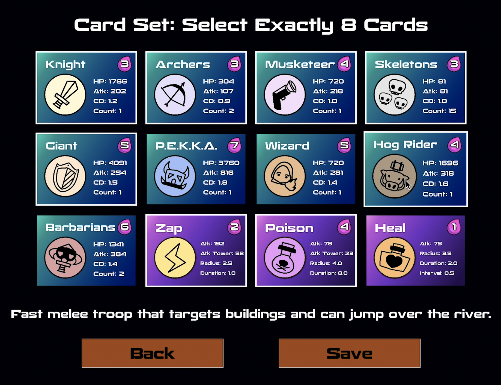
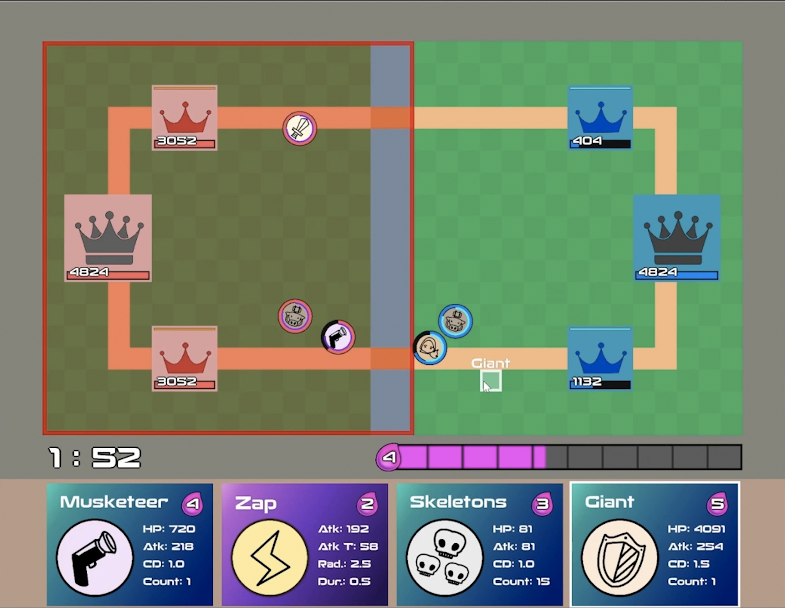

# Freshman (2024 Spring) Introduction to Programming II
## Final Project - Arena Legends
- a multiplayer battle game developed in C++ inspired by Clash Royale
- features:
  - diverse character roster with unique abilities and polished icons
  - specific character movement and collision detection
  - HP and cooldown display details
  - base tower activation mechanism
  - single-player AI mode
  - two-player online battle functionality

### Project Deliverables
- ***Overview and Technical Walkthrough***: ❗️❗️ [YouTube Video link](https://www.youtube.com/watch?v=t3sOuUWLjIs) ❗️❗️ (CC subtitles are available)
- Online Battle Gameplay Demo: [YouTube Video Link](https://www.youtube.com/watch?v=l4Rl-ES-RFU)
- Card Selection Screenshot:

- Gameplay Screenshot:

### Others
- the **coursework** of I2P2: [I2P2-Course](https://github.com/rogerfan48/I2P2-Course)
- **MiniProject 2** of I2P2: [I2P2-TowerDefense](https://github.com/rogerfan48/I2P2-TowerDefense)
